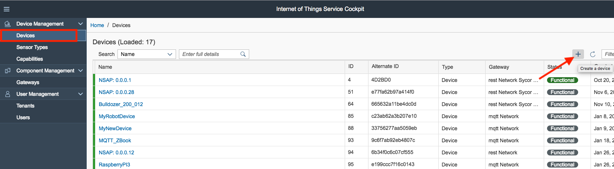
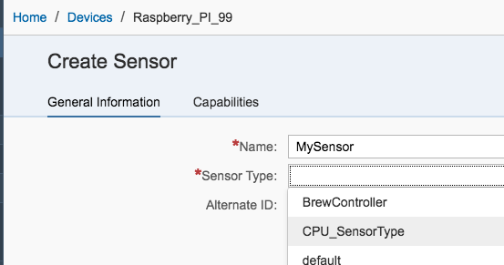

# Tutorial: Connect the Raspberry PI with SAP Leonardo IoT

## Scenario Overview

In this sceanario we want to connect your device (Laptop or Raspberry PI) with SAP Leonardo IoT Foundation, build up the "digital twin" and finally we want to create an SAP UI5 Application to display or device Information.
Optional: We create an mobile Application where we should be able to display our Device measeurements with SAP Mobile Cards

In Detail we split the scenario in the following parts:

Excercise 1: Create the Device with SAP IoT Service, connect the Raspberry PI and send you first data.
  
Excercise 2: Build the Digital Twin with SAP Application Enablement
  
Excercise 3: Developing an SAP IoT SAPUI5 Application with SAP Web IDE
  
Excercise 4: Configure SAP Mobile Cards to display the Measurements on your Mobile Device
  

### Excercise 1.1 - Create the Device via SAP IoT Service

Open the SAP IoT Service cockpit by opening the following URL: 

https://sycor.eu10.cp.iot.sap/iot/cockpit/#

Login with the provided user and password.
And choose the "Devices" entry and  press the + icon to create a new device:

In the upcoming screen define a name eg. 'Raspberry_PI_01' (identical to the user id from the cokpit user 'azubi_01').
Futhernore select as "Gateway" the MQTT network (id = 2) and save your changes.

Congratulations! If the screen looks like this, u have successfully crated an Device on SAP IoT Services.

The final last step is now, to create a new "Sensor".
To do this click again the + button and specify a new sensor:

| Left-aligned | Center-aligned | Right-aligned |
| :---         |     :---:      |          ---: |
| git status   | git status     | git status    |
| git diff     | git diff       | git diff      |

