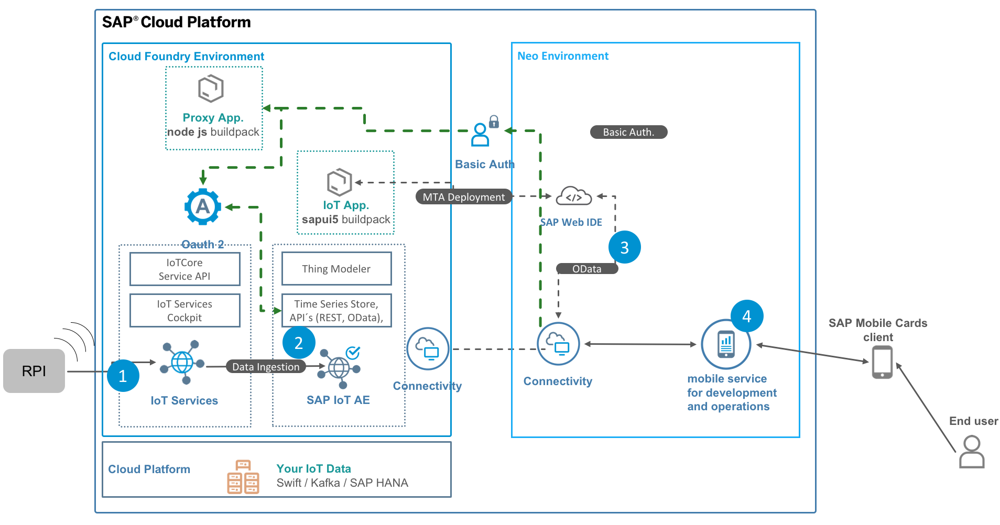

# Tutorial: Connect the Raspberry PI with SAP Leonardo IoT

## Scenario Overview

In this sceanario we want to connect your device (Laptop or Raspberry PI) with SAP Leonardo IoT Foundation, build up the "digital twin" and finally we want to create an SAP UI5 Application to display or device Information.
Optional: We create an mobile Application where we should be able to display our Device measeurements with SAP Mobile Cards

In Detail we split the scenario in the following parts:

Excercise 1: Create the Device with SAP IoT Service, connect the Raspberry PI and send you first data.
Start here with [Exercise1](./exercise1/README.md)
  
Excercise 2: Build the Digital Twin with SAP Application Enablement
Start here with [Exercise1](./exercise1/README.md)
  
Excercise 3: Developing an SAP IoT SAPUI5 Application with SAP Web IDE
Start here with [Exercise1](./exercise1/README.md)
  
Excercise 4: Configure SAP Mobile Cards to display the Measurements on your Mobile Device
Start here with [Exercise1](./exercise1/README.md)
  

