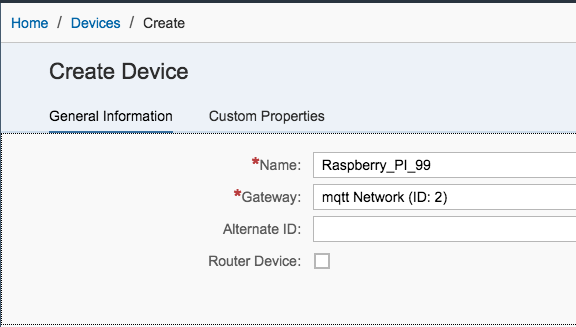
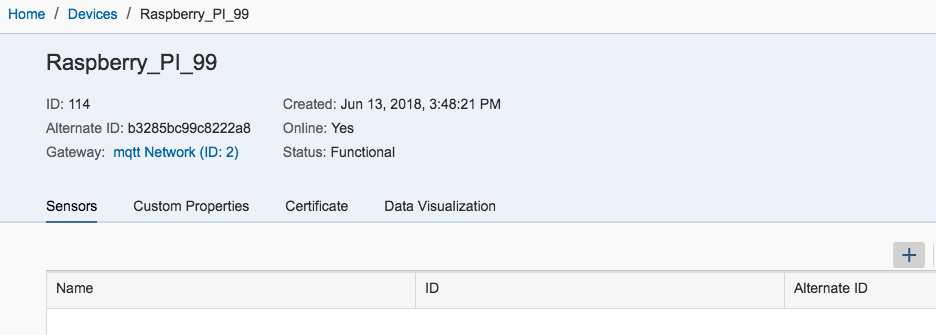
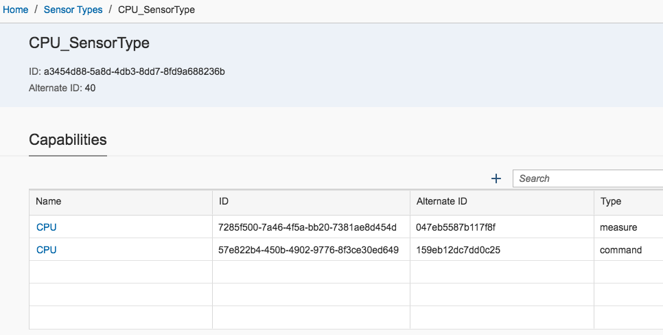
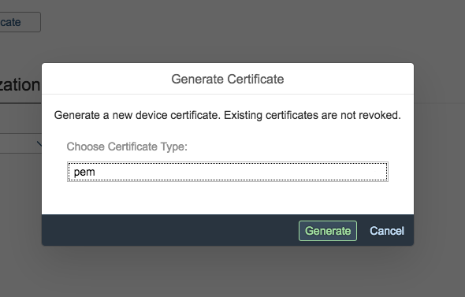
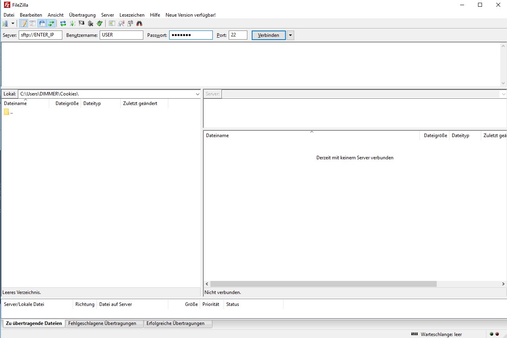

### Excercise 1 - Create the Device via SAP IoT Service

#### Create the Device 

Open the SAP IoT Service cockpit by opening the following URL: 

https://sycor.eu10.cp.iot.sap/iot/cockpit/#


Login with the provided user and password.
And choose the "Devices" entry and  press the + icon to create a new device:


In the upcoming screen specifiy your device like this:

| Property | Value |
| --- | --- |
| Name | e.g. Raspberry_PI_01 (identical to the user id from the cokpit user e.g 'azubi_01' = 01)|
| Gateway | MQTT network (id = 2) |




Congratulations! If the screen looks similiar to this, u have successfully created an IoT Device on SAP IoT Services.



The last step is now, to create a new "Sensor" an refer to an existing "Sensor Type" (for simplification the Sensor Type was created before).
To do this click again the + button and specify a new sensor:


| Property | Value |
| --- | --- |
| Name | e.g. MySensor |
| Sensor Type | CPU_SensorType |


The Sensor Type "CPU_SensorType" has the folowing definition:



As u cann see the Sensor Type contains two capabilities, one for the CPU usage in % and the second one can be used to send data back to our device. Because of the fact that we using MQTT we are able to communicate bi-directional with the device.


#### Download the Device Certificate

To communicate with our device on a secure way, it´s required to download the device certificate by clicking the "Generate Device" button.
Please choose the "PEM" format:



Store the files first on your laptop and afterwards transfer the files via FTP to the Raspberry.
For this u can use of sn FTP Client like e.g. [Filezilla](https://filezilla-project.org/) to connect.



Important: Please note/copy the Secret this is required later one to generate the final certificates which we want to use in our little program to send our data.

#### Open a connection via Putty to the Raspberry PI

To connect from your local laptop to the Raspberry PI, please download [Putty](https://www.putty.org/) (no installation required). Execute the "putty.exe" and create an new SHH connection:


Swicth now to the directory where you have downloaded the certificate.

First check the name of your "*.pem" file by typing the following command:
```
> ls -la
total 8
drwxr-xr-x@ 3 fabianlehmann  staff    96 14 Jun 08:10 .
drwxr-xr-x  6 fabianlehmann  staff   192 14 Jun 08:10 ..
-rw-r--r--@ 1 fabianlehmann  staff  3286 14 Jun 08:09 my-device_certificate.pem
```

In the next step create the "key" and "crt" file:

```
> openssl rsa -in my-device_certificate.pem -out credentials.key
Enter pass phrase for my-device_certificate.pem: <enter here the previous copied secrect>
> openssl x509 -in my-device_certificate.pem -out credentials.crt
```

Verifiy now if booth files are present:

```
> ls -la
drwxr-xr-x@ 5 fabianlehmann  staff   160 14 Jun 08:41 .
drwxr-xr-x  6 fabianlehmann  staff   192 14 Jun 08:10 ..
-rw-r--r--  1 fabianlehmann  staff  1501 14 Jun 08:41 credentials.crt
-rw-r--r--  1 fabianlehmann  staff  1675 14 Jun 08:41 credentials.key
-rw-r--r--@ 1 fabianlehmann  staff  3286 14 Jun 08:09 my-device_certificate.pem
```

#### GIT clone

The easiest way to get 
