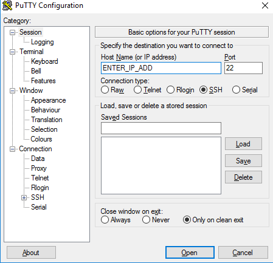
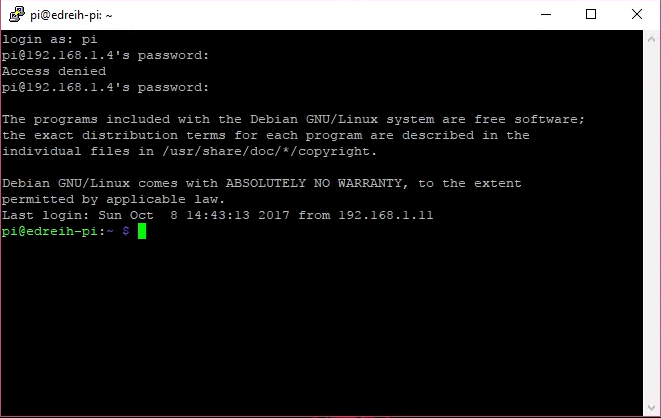
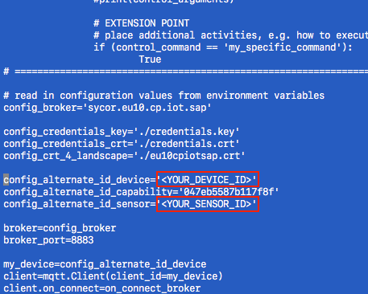

### Excercise 1 - Create ans connect the Raspberry PI to SAP IoT Service and send your 1st data stream

#### Create the Device 

Open the SAP IoT Service cockpit by opening the following URL: 

[SAP CP IoT Service ](https://sycor.eu10.cp.iot.sap/iot/cockpit/#)


Login with the provided user and password.
And choose the "Devices" entry and  press the + icon to create a new device:


In the upcoming screen specifiy your device like this:

| Property | Value |
| --- | --- |
| Name | e.g. Raspberry_PI_01 (identical to the user id from the cokpit user e.g 'azubi_01' = 01)|
| Gateway | MQTT network (id = 2) |


If the screen looks similiar to this, u have successfully created an IoT Device on SAP IoT Services.


The last step is now, to create a new "Sensor" an refer to an existing "Sensor Type" (for simplification the Sensor Type was created before).
To do this click again the + button and specify a new sensor:


| Property | Value |
| --- | --- |
| Name | e.g. MySensor |
| Sensor Type | CPU_SensorType |


The Sensor Type "CPU_SensorType" has the following definition:


As u cann see the Sensor Type contains two capabilities, one for the CPU usage in % and the second one can be used to send data back to our device. Because of the fact that we using MQTT we are able to communicate bi-directional with the device.


#### Download the Device Certificate

To communicate with our device on a secure way, it´s required to download the device certificate by clicking the "Generate Device" button.
Please choose the "PEM" format:


Store the files first on your laptop and afterwards transfer the files via FTP to the Raspberry.
For this u can use of sn FTP Client like e.g. [Filezilla](https://filezilla-project.org/) to connect.


Important: Please note/copy the Secret this is required later one to generate the final certificates which we want to use in our little program to send our data.

#### Open a connection via Putty to the Raspberry PI

To connect from your local laptop to the Raspberry PI, please download [Putty](https://www.putty.org/) (no installation required). Execute the "putty.exe" and create an new SHH connection:





Swicth now to the directory where you have downloaded the certificate.

First check the name of your "*.pem" file by typing the following command:
```
> ls -la
total 8
drwxr-xr-x@ 3 fabianlehmann  staff    96 14 Jun 08:10 .
drwxr-xr-x  6 fabianlehmann  staff   192 14 Jun 08:10 ..
-rw-r--r--@ 1 fabianlehmann  staff  3286 14 Jun 08:09 my-device_certificate.pem
```

In the next step create the "key" and "crt" file:

```
> openssl rsa -in my-device_certificate.pem -out credentials.key
Enter pass phrase for my-device_certificate.pem: <enter here the previous copied secrect>
> openssl x509 -in my-device_certificate.pem -out credentials.crt
```

Verifiy now if booth files are present:

```
> ls -la
drwxr-xr-x@ 5 fabianlehmann  staff   160 14 Jun 08:41 .
drwxr-xr-x  6 fabianlehmann  staff   192 14 Jun 08:10 ..
-rw-r--r--  1 fabianlehmann  staff  1501 14 Jun 08:41 credentials.crt
-rw-r--r--  1 fabianlehmann  staff  1675 14 Jun 08:41 credentials.key
-rw-r--r--@ 1 fabianlehmann  staff  3286 14 Jun 08:09 my-device_certificate.pem
```

#### GIT clone

The easiest way to get the example python programm and the global SAP IoT Service certificate is via the GIT cli.
Please execute the following command:
```
> git clone https://github.com/fableh/azubi_train_2018.git

> ls -la 
total 24
drwxr-xr-x@  6 fabianlehmann  staff   192 14 Jun 08:49 .
drwxr-xr-x   6 fabianlehmann  staff   192 14 Jun 08:10 ..
drwxr-xr-x  11 fabianlehmann  staff   352 14 Jun 08:49 azubi_train_2018
-rw-r--r--   1 fabianlehmann  staff  1501 14 Jun 08:41 credentials.crt
-rw-r--r--   1 fabianlehmann  staff  1675 14 Jun 08:41 credentials.key
-rw-r--r--@  1 fabianlehmann  staff  3286 14 Jun 08:09 my-device_certificate.pem
```
In the next step please copy or move the "credentials.crt" and the "credentials.key" file into the "src" directory of your newly cloned git repository by executing the following:

```
> cp credentials.crt credentials.key azubi_train_2018/src
```

Switch now to the src directory and verify that all files are now present:

```
> cd azubi_train_2018/src
> ls -la
total 48
drwxr-xr-x   7 fabianlehmann  staff   224 14 Jun 08:52 .
drwxr-xr-x  11 fabianlehmann  staff   352 14 Jun 08:49 ..
-rw-r--r--   1 fabianlehmann  staff     1 14 Jun 08:49 README.md
-rw-r--r--   1 fabianlehmann  staff  1501 14 Jun 08:52 credentials.crt
-rw-r--r--   1 fabianlehmann  staff  1675 14 Jun 08:52 credentials.key
-rw-r--r--   1 fabianlehmann  staff  5221 14 Jun 08:49 eu10cpiotsap.crt
-rw-r--r--   1 fabianlehmann  staff  3656 14 Jun 08:49 mqtt_cpu_usage.py
```

To modify and execute the "mqtt_cpu_usage.py" python program, please change the permission by exectung the following:

```
> chmod 777 mqtt_cpu_usage.py
```

Afterwards you can open the "mqtt_cpu_usage.py" program:

```
> nano mqtt_cpu_usage.py
```

Scroll now a bit down and change the following values that fits to your device/sensor config:



If the changes are done, u can save it by pressing "CTRL + X" and finally type "y" to save the changes!!!

#### Execute the program and verify it via the SAP IoT Service cockpit

Now we are ready and can execute our program by executing the following:

```
> python mqtt_cpu_usage.py"
```

If the program works successfully u should see something like this:

```
Connected to MQTT broker with result code: 0
on_subscribe - message_id: 1 / qos: (0,)
15953469440
{ "capabilityAlternateId": "047eb5587b117f8f","sensorAlternateId": "a63ac7ea98ec44ce", "measures":22.7}
(0, 2)
15955779584
{ "capabilityAlternateId": "047eb5587b117f8f","sensorAlternateId": "a63ac7ea98ec44ce", "measures":9.5}
(0, 3)
```

If you now swicth back to the "cockpit" and select your device, scroll down to the "Data Visualization" section and choose the sensor, capabilty and property.

As result you should see (hopefully) the incoming data:


**Congratulations! you are successfuly finished the first excercise !!!**

