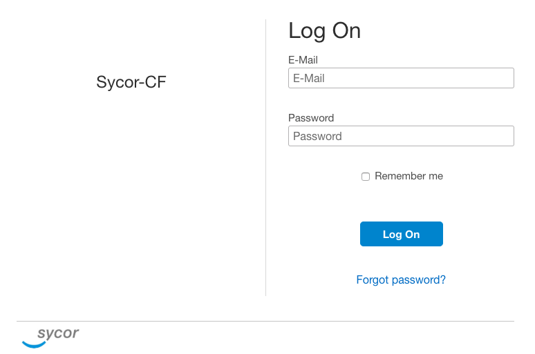
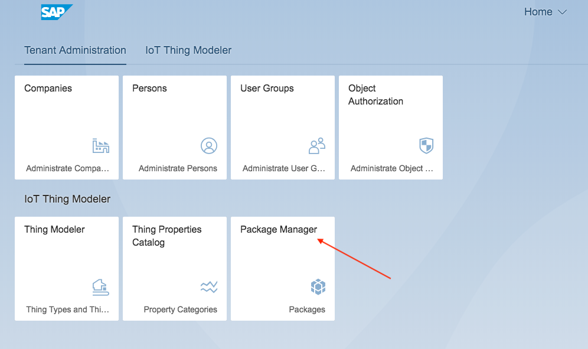
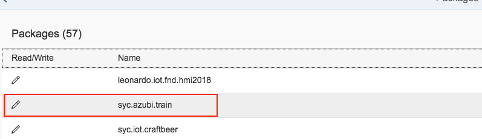
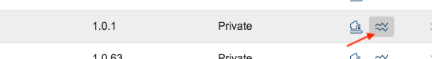
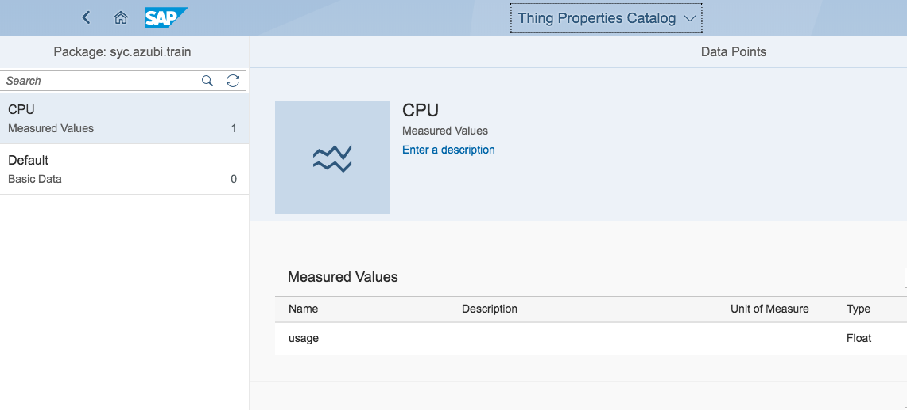
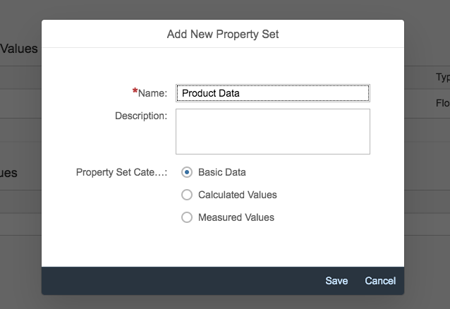
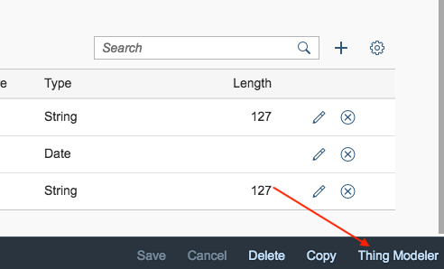

### Excercise 2 - Build up the Digital Twin with SAP Cloud Platform IoT Application Enabalmenet

#### Login to SAP CP IoT Application Enablment

Please enter the SAP Cloud Platform IoT Application Enablment:

[SAP CP IoT AE](https://sycor-cf-subaccount.iot-sap.cfapps.eu10.hana.ondemand.com/launchpage/index.html#Shell-home)

Enter your credentials an "Log on":

Afterwards you can see the initial launchpad, press now the Package Manager tile to enter the application:

Now search the "syc.azubi.train" package:

And click on the follwing button to display the "Property Sets":

As u can see there are 2 property sets available:

Please familarize with CPU "Property Set" (PS) this is pre- created and will be used for the Thing configuration.

In the next step u can create now an own PS e.g. for some Basic informations, feel free an define your own.

Based on the fact that these package is used together, it make sense also here to use an identifier.

You can finally spcefiy some fields e.g.:

| Property | Type |
| --- | --- |
| Product | String |
| Last Maintenance | Date |
| Color | String |
| ... | ... |

Save yor changes and switch over to the "Thing Modeler" by pressing the link in the lower right corner:

