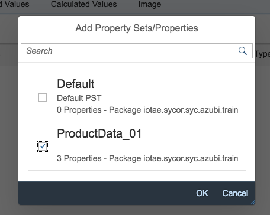
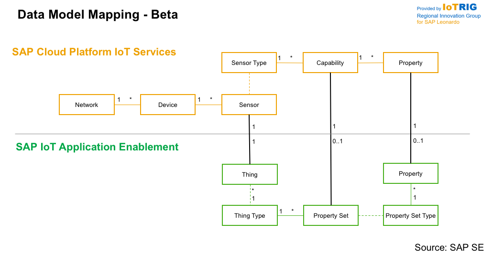
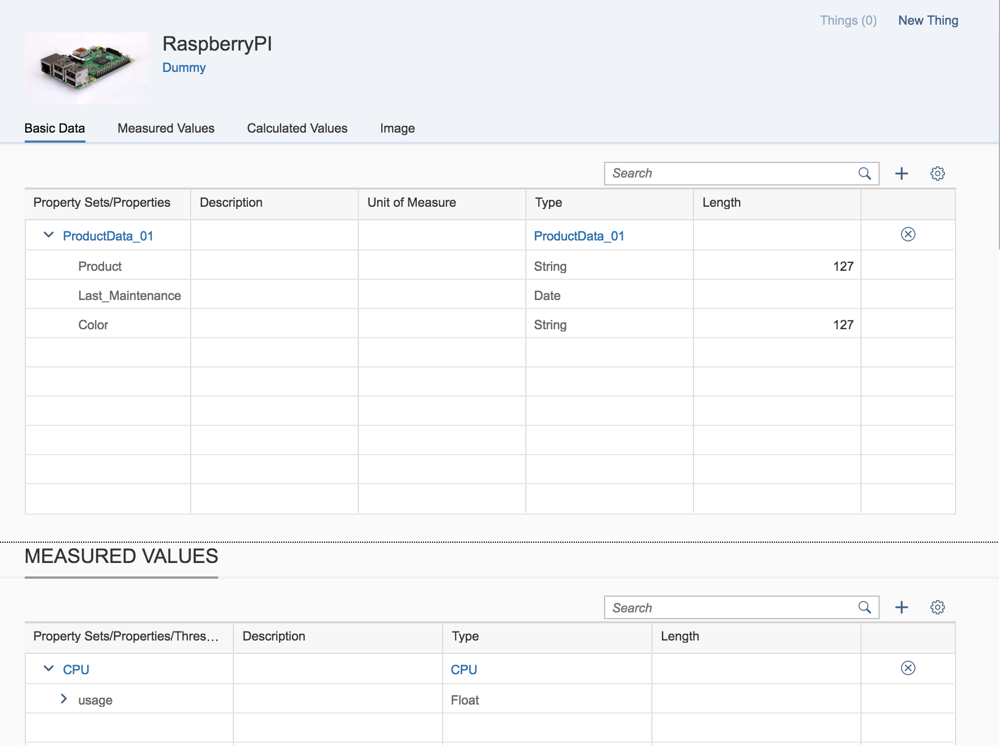

### Excercise 2 - Build up the Digital Twin with SAP Cloud Platform IoT Application Enabalmenet

#### Login to SAP CP IoT Application Enablment

Please enter the SAP Cloud Platform IoT Application Enablment:

[SAP CP IoT AE](https://sycor-cf-subaccount.iot-sap.cfapps.eu10.hana.ondemand.com/launchpage/index.html#Shell-home)

The offical SAP Help documentation can be found here:

[SAP Help](https://help.sap.com/viewer/p/SAP_IOT_APPLICATION_SERVICES)

Enter your credentials an "Log on":

Afterwards you can see the initial launchpad, press now the Package Manager tile to enter the application:

Now search the "syc.azubi.train" package:

And click on the follwing button to display the "Property Sets":

#### Creat a new Property Set

As u can see there are 2 property sets available:

Please familarize with CPU "Property Set" (PS) this is pre- created and will be used for the Thing configuration.

In the next step u can create now an own PS e.g. for some Basic informations, feel free an define your own.

Based on the fact that these package is used together, it make sense also here to use an identifier.

You can finally spcefiy some fields e.g.:

| Property | Type |
| --- | --- |
| Product | String |
| Last Maintenance | Date |
| Color | String |
| ... | ... |

#### Create a new Thing Type

Save yor changes and switch over to the "Thing Modeler" by pressing the link in the lower right corner:

Afterwards creat a new Thing Type:

By pressing the + button in the "Basic Data" section should link now yor previous created property set:

Futhermore link the CPU property set under "Measured Values".

As result the final Thing Type looks now like this, which has now two linked property sets:

#### Create a new Thing

To bind our real "IoT Device" the Raspberry PI to our newly created Thing Type we need to create an new Thing.
This Thing is the virtual representaion ans has 1:1 relationship to our SAP IoT service type.

You start the creation process for our Thing by pressing the "new Thing" button in the upper left corner.

