### Excercise 3 - Visualize the IoT Data by develoing an SAPUI5 Application with SAP Web IDE

#### Open SAP Web IDE

We want cover now in this Excercise, how we can developing an simple SAP UI5 Application to visualize our IoT Data.

As u can see in the picture, SAP Application Enablement provides different tools to support the developer ecperience:

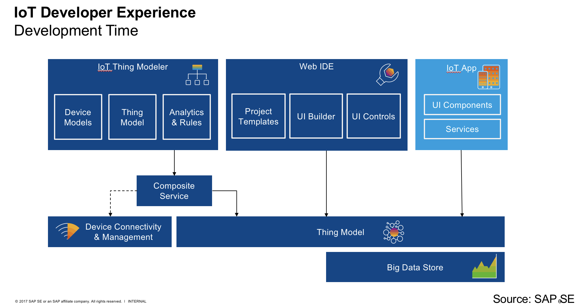

Please enter the SAP Web IDE (depending on the bandwith this can be took a while)

[SAP Web IDE](https://webidecp-a57d428ce.dispatcher.hana.ondemand.com)

Futher Informations about SAP Web IDE and the available Controls for SAP Web IDE in the context with SAP IoT Application Enablmenet:

[SAP Help](https://help.sap.com/viewer/825270ffffe74d9f988a0f0066ad59f0/Cloud/en-US/0221845d73ad403ab2852142f3179177.html)

[SAP IoT Application Enablement Developer Guide](https://help.sap.com/viewer/53368b9f996c42fda75faccf5e986873/1.57.0.0/en-US)

#### Familarize with the SAP Web IDE and check the Plugin

After the successfully start of the SAP Web IDE, you should see an empty workspace:

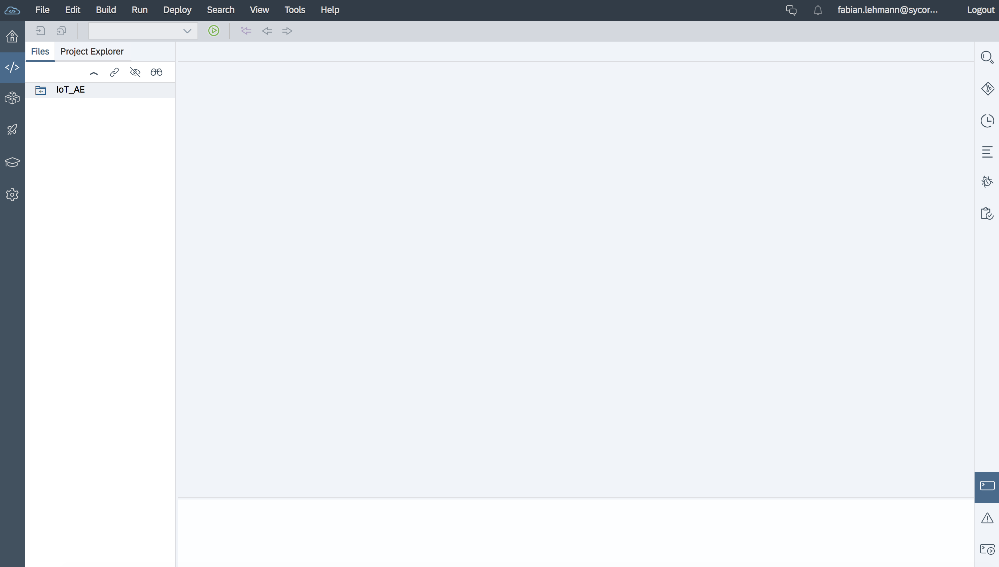

Please talke 5 minutes and familarize with the SAP Web IDE.
Afterwards, please open the preferences by clicking on the following symbol on the left naviagtion panel.
Verify that the IoT Application Enablement Feature is enabled:

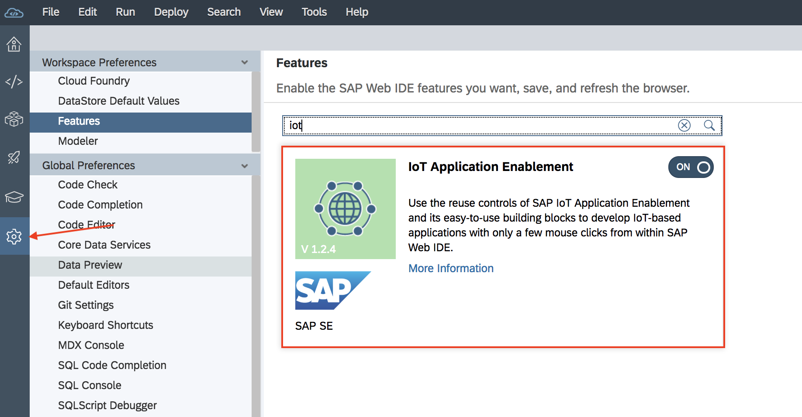

#### Create a new Projekt

After we´ve successfully checked the prerequisite we can now create an new project.
Pleas use "*File* -> *New* -> *Project from Template*":

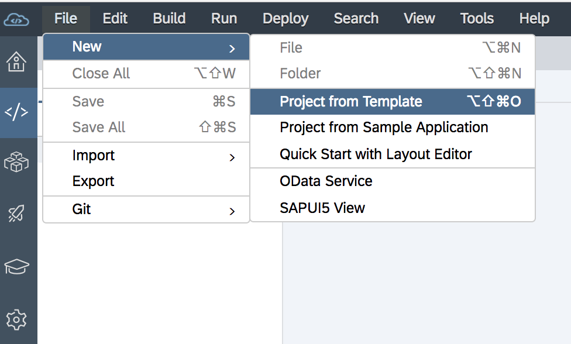

Select IoT Application:

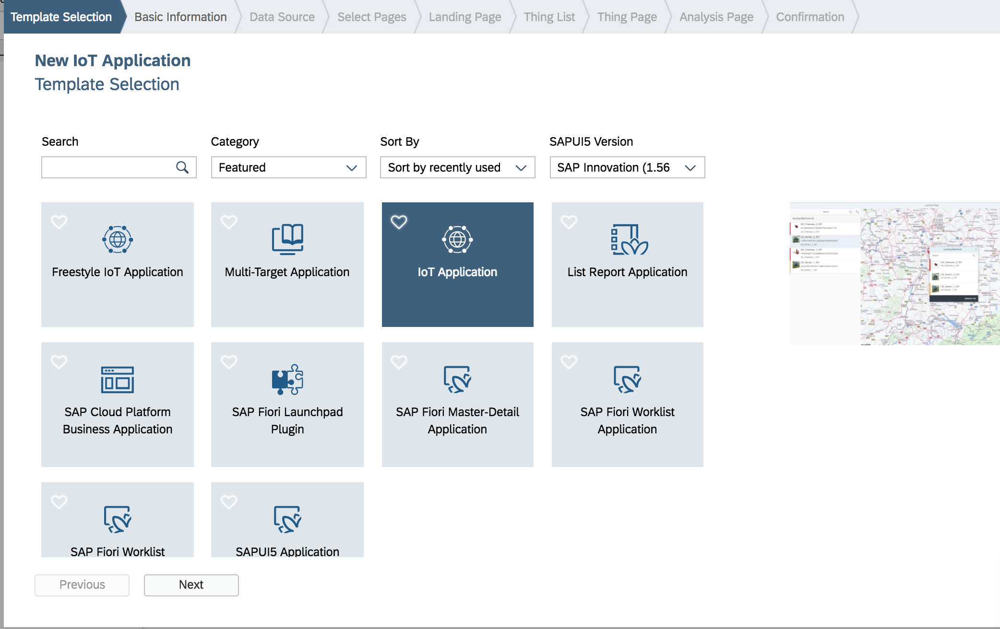

Provide now the "Basic Infomation":

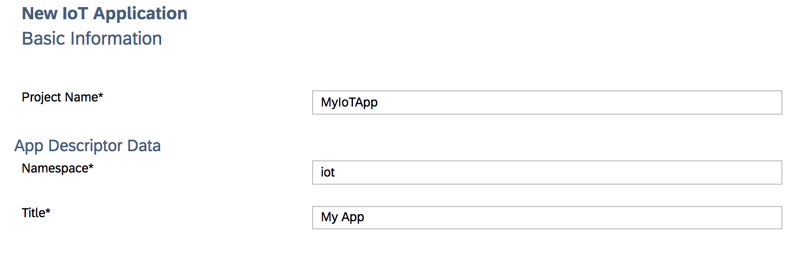

Select the following "OData" Service:

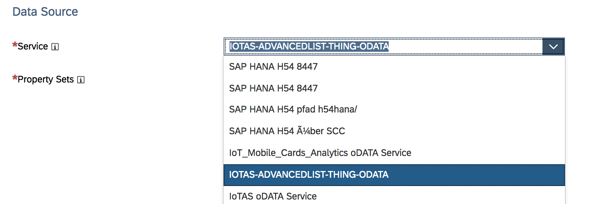

Search the "Property Set":

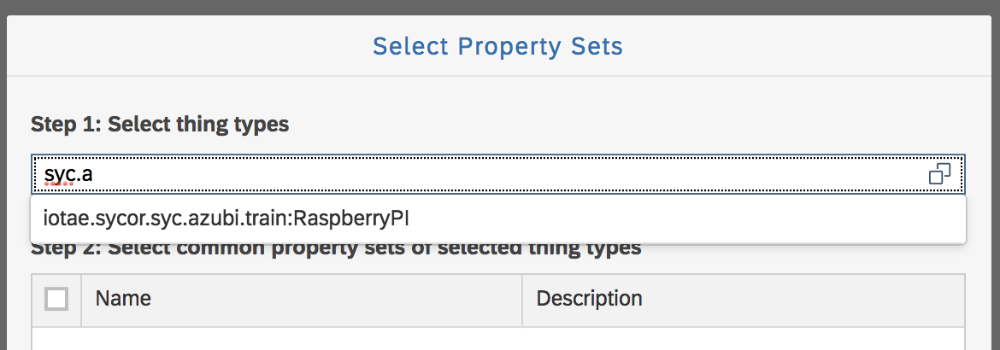

And all entities and choose next:

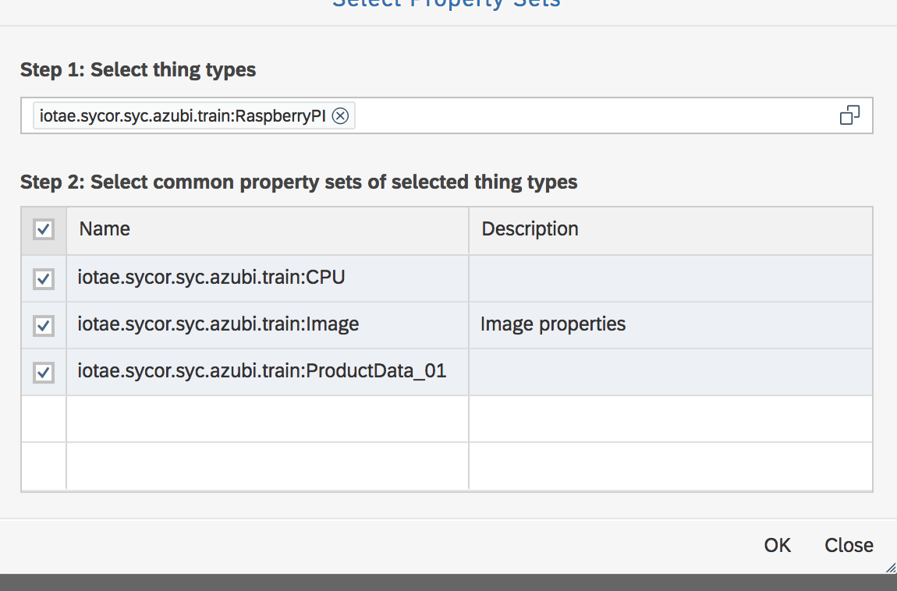

In the next screen u can see the pages which are genearted:

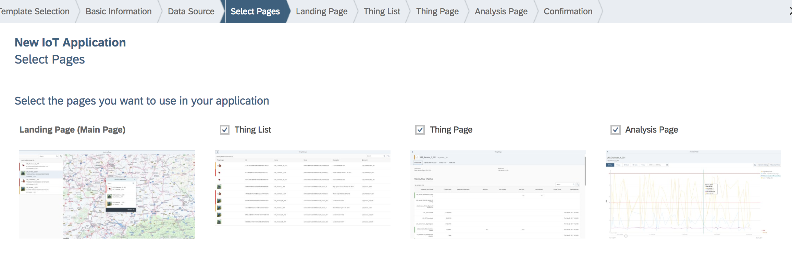

In the upcomming screens u can maintain each page settings in detail.

Finally u can finish the "Wizard", afterwards u can find the createt project in your workspace:

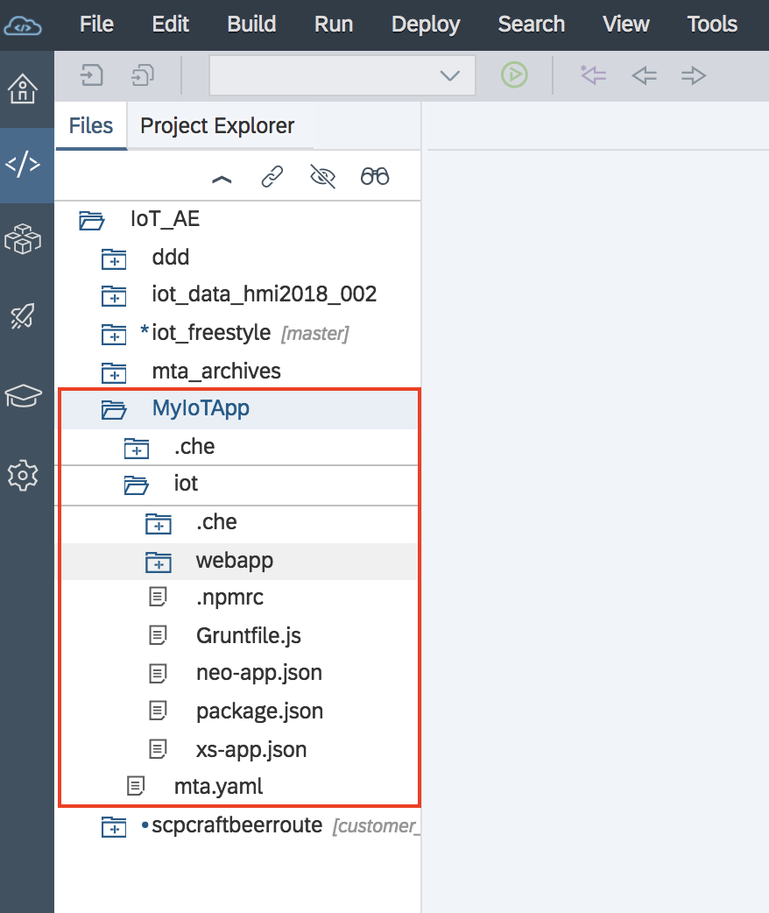

