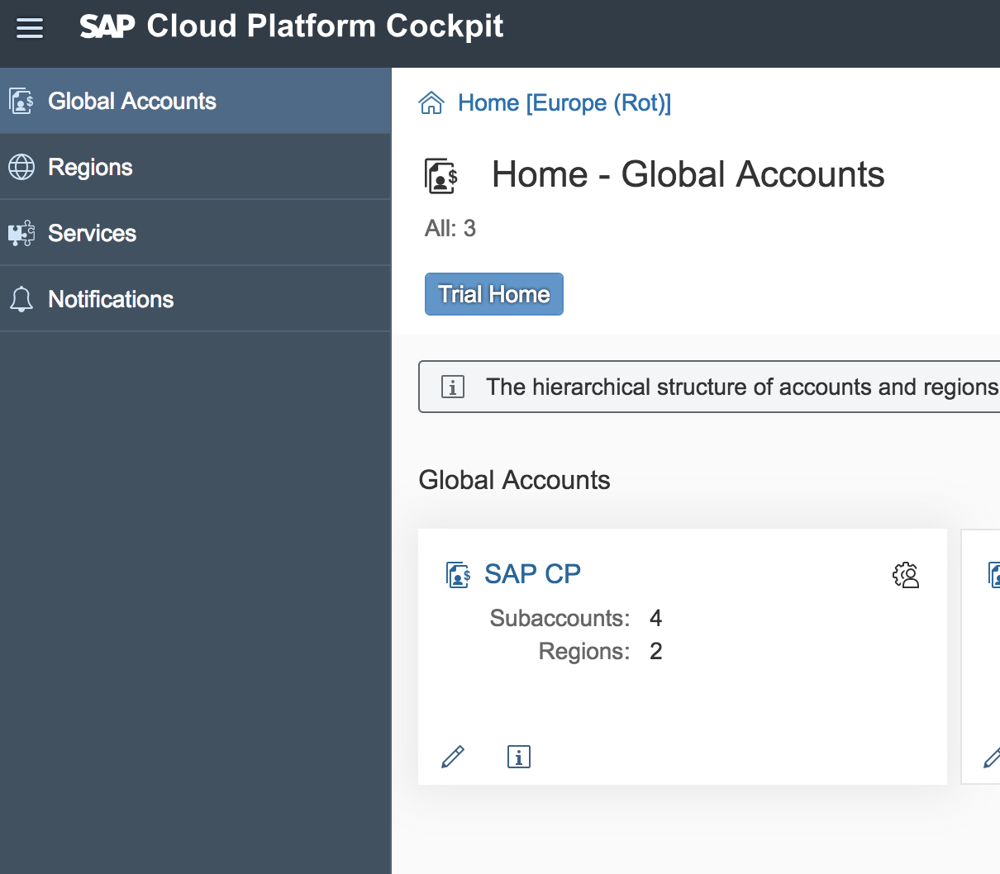
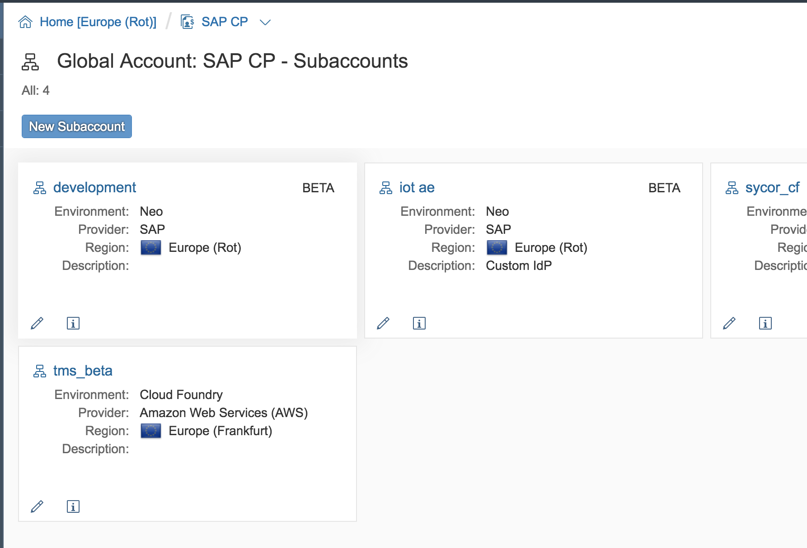
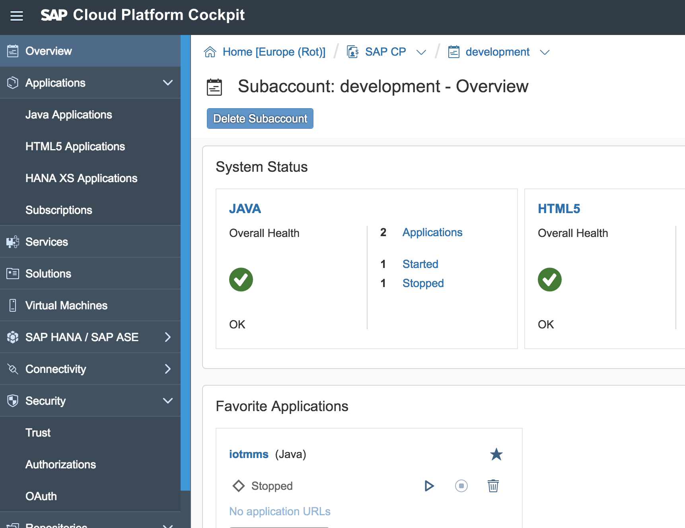
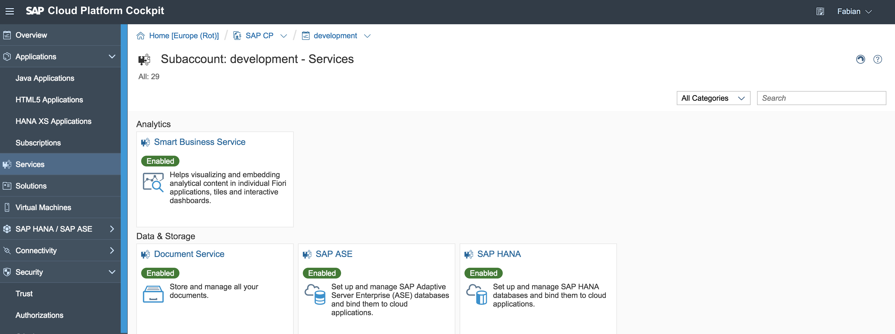
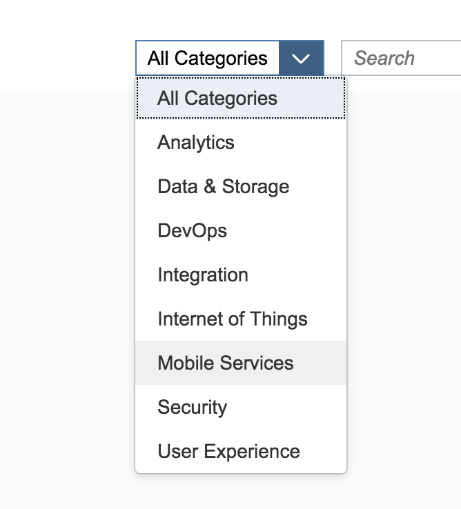
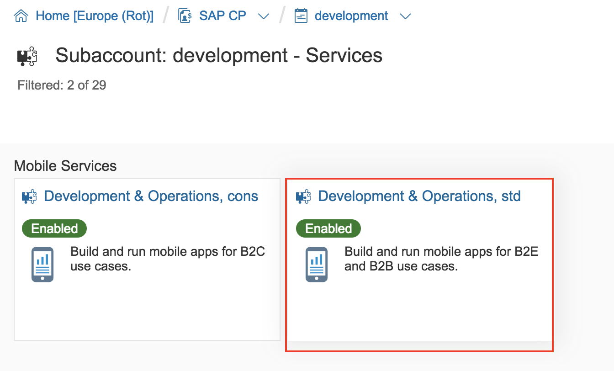
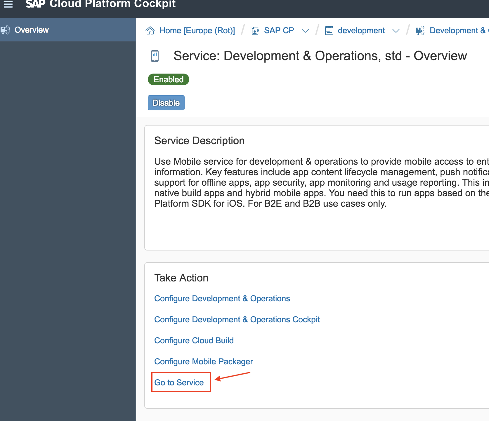

### Excercise 4 - Mobilize your IoT Data with SAP Mobile Cards

#### Enter the SAP Cloud Platform Cockpit

[SAP Cloud Platform Cockpit](https://account.hana.ondemand.com/cockpit#)

Enter first the SAP Cloud Platform Global Account "**SAP CP**":

Now enter the Sub Account "**Development**":

You should now see a lot of different menu items, feel free to discover the different options:

#### Enter the SAP Mobile Services

From the left menu please switch over to the "Sewrvices":

You cann now search or easier specify the "**mobile services**" category: 

Enter now the right tile "**Development & Operations, std**":

And finally "**Go to the Service**" by clicking on the link:

[SAP Mobile Cards Client for Android](https://play.google.com/store/apps/details?id=com.sap.content2go)

[SAP Mobile Cards Client for iOS](https://itunes.apple.com/us/app/sap-content-to-go/id1168110623?mt=8)

https://sap-proxy.cfapps.eu10.hana.ondemand.com/app.svc/measurements?

$filter=id eq '**your-thing-id**' and time ge datetime'2018-06-15T00:00:00' and time lt datetime'2018-06-16T00:00:00'&$format=json&$top=3
