### Excercise 4 - Mobilize your IoT Data with SAP Mobile Cards

#### Enter the SAP Cloud Platform Cockpit

[SAP Cloud Platform Cockpit](https://account.hana.ondemand.com/cockpit#)

Enter first the SAP Cloud Platform Global Account "**SAP CP**":

Now enter the Sub Account "**Development**":

You should now see a lot of different menu items, feel free to discover the different options:

#### Start SAP Mobile Services

From the left menu please switch over to the "Services":

You cann now search for the different services, scroll down or easier specify the category.
Based on the fact that we want to develop a mobile application we can easily use the dropdown and select "**mobile services**":

Enter now the right tile "**Development & Operations, std**":

And finally "**Go to the Service**" by clicking on the link:

#### Discover the "proxy" OData Service for your Thing

Based on the fact, that the data access for SAP Application Enablement works only with OAuth 2.0.
We´ve prerpared an Node JS proxy application which allows u to fetch the data with basic authentification from your thing.

Please use for testing the follwoing credentials:

| User | Password |
| --- | --- |
| foo | bar|

The URL mus be adjusted a bit, the syntax is the follwoing:

https://sap-proxy.cfapps.eu10.hana.ondemand.com/app.svc/measurements?$filter=id eq '**your-thing-id**' and time ge datetime'2018-06-15T00:00:00' and time lt datetime'2018-06-16T00:00:00'&$format=json&$top=1

**Please Adjust the datetime value to a valid period where u sure that the data was send successfully into SAP Application Enablement.**

As result u should now see the following response adapted to your thing:

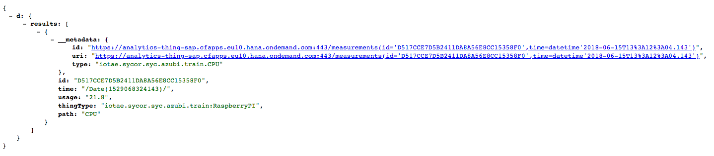

We want to use this OData service to display our last measurement on SAP Mobile Cards.

Pleas save the response as a file with the following name iot_data.json.

Open the file wit a text editor of your choice and edit the structure a bit an finally save it:

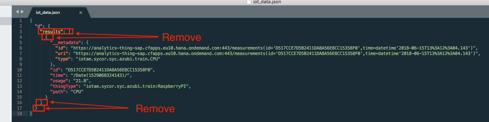

#### Install the SAP Mobile Cards client software on your device

[SAP Mobile Cards Client for Android](https://play.google.com/store/apps/details?id=com.sap.content2go)

[SAP Mobile Cards Client for iOS](https://itunes.apple.com/us/app/sap-content-to-go/id1168110623?mt=8)

#### Create your first Mobile Card to fetch and display your IoT Data

Please enter [Mobile Service for Development and Operations](https://mobile-a142e7288.dispatcher.hana.ondemand.com/)

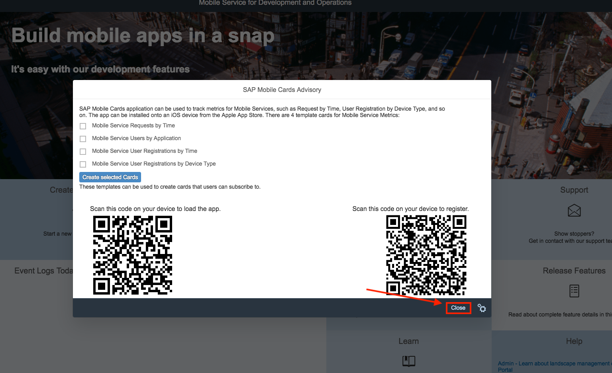

Close the upcoming Popup and select on the left hand side the "SAP Mobile Cards" entry:

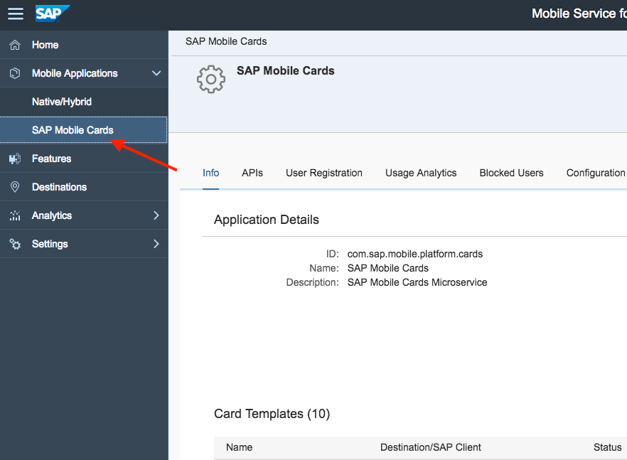

Create a new "Card":

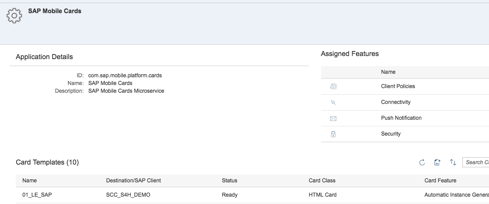

And provide the following data:

 Description | Value |
| --- | --- |
| Name: | *<the name of the card, please use an unique name>*|
| Data Refresh Mode: | *keep up-to-date*|
| Destination: | *IoT Data*|
| Template Source: | *Template Manager*|
| HTML Template: | *User defined template*|
| Query: | */measurements?$filter=id eq **'your-thing-id'** and time ge datetime'2018-06-15T00:00:00' and time lt datetime'2018-06-16T00:00:00'&$format=json&$top=3*|

In the next step, please uplaod the "iot_data.json" file:

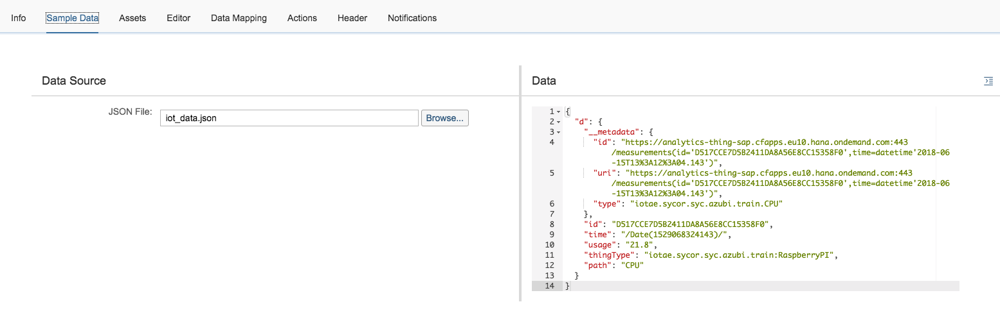

Switch ove to the "Editor" tab and delete the content, finally provide the follwoing code snippet

[HTML Template Source Code Snippet](./html-card-src.txt)

Now verify in the "Data Mapping" tab that all fields are mapped correctly if not you can modify the mapping.

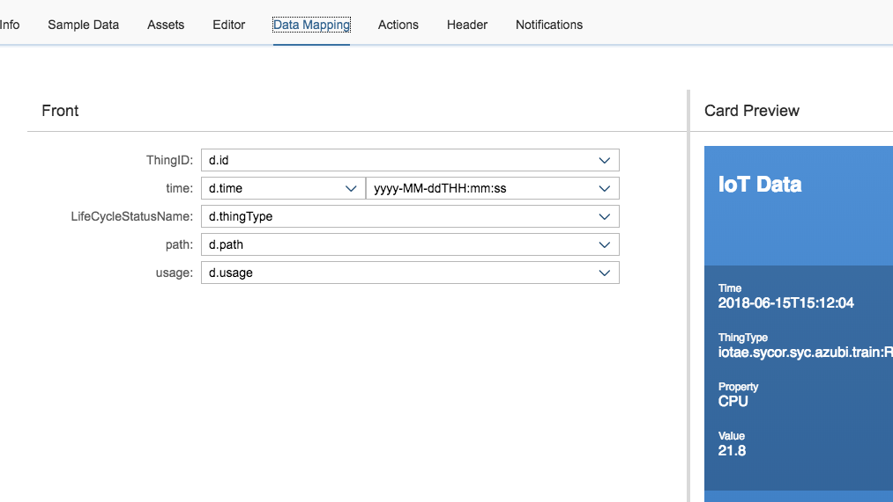

Finally u can specify the message which will send out if a new card is availble:

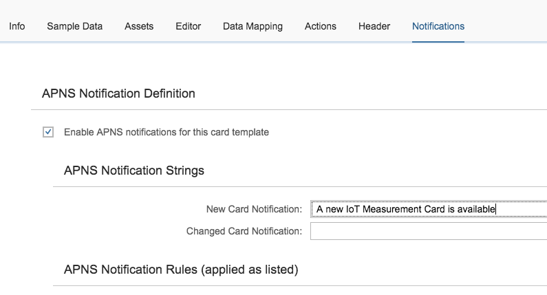

Please save your changes.

#### Enter the SAP Cloud Platform Cockpit

Now you can scan this tag to register ant authorize your device to SAP Mobile Cards:

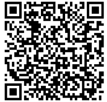

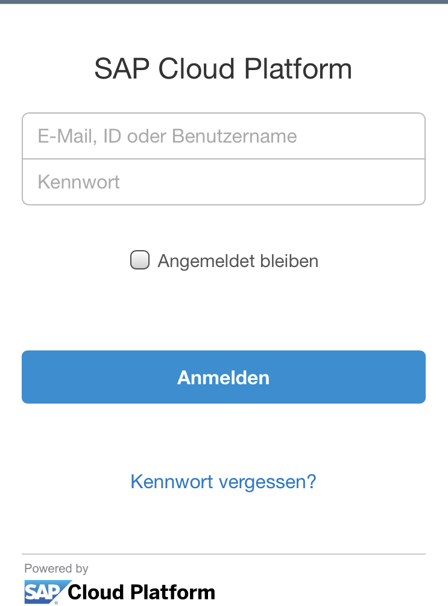

Click "Authorize":

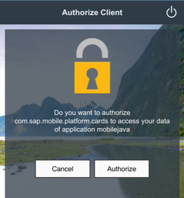

In the next step you will be registered at SAP Cloud Platform Mobile Services.

And can now specify an "Passcode" or skip this.

Search and subscribe now to your card:

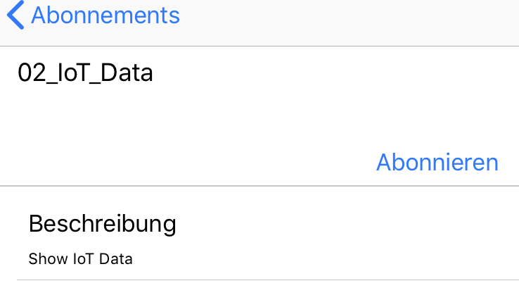

After pressing the Subscription link you should see a preview of your screen:

As result you should now see the "IoT Data" on your mobile device:

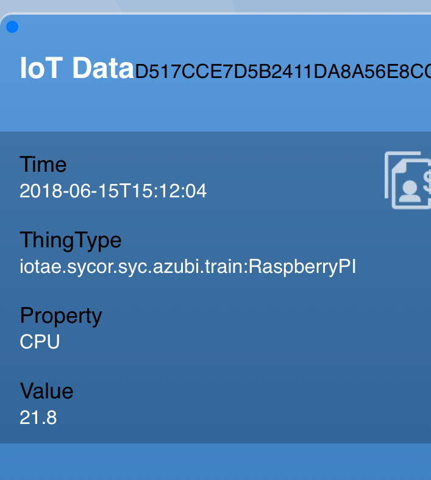

